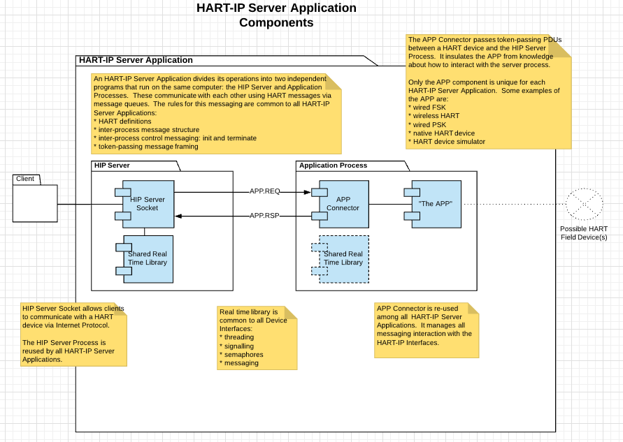
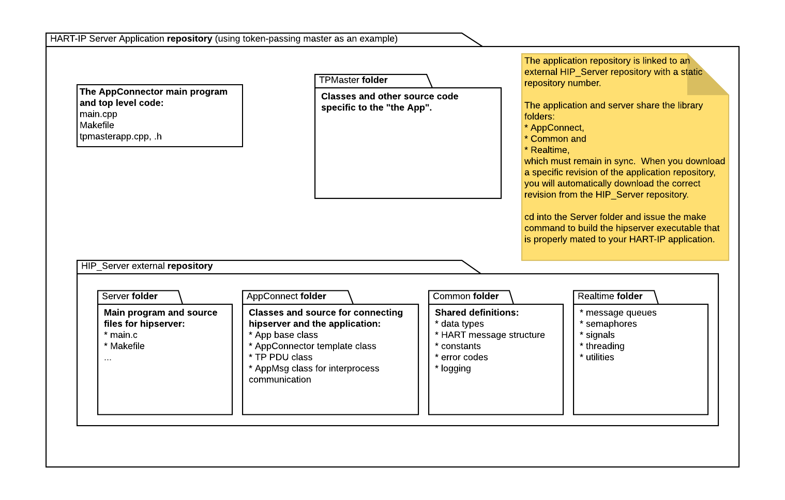

 Fieldcomm Group
=====================

# Overview

A HART-IP Server is composed of two cooperating processes (programs):

-   Hip server

-   hip application

The interface between the Server process and the application process consists of
two POSIX message queues. The messages are HART Token-Passing message frames,
plus a transaction ID and control information. This interface is a generic HART
application layer interface, without timing, physical layer, or bus arbitration
considerations. Such considerations are addressed within the Application as
required. A simulated device, for instance, would not have such considerations.

The function of the HIP Server process (hipserver) is to manage TCP/UDP
communications with multiple hosts and marshal HART messages to and from a
HART-IP Application. It shields the Application from knowledge of the HART-IP
interface requirements, TCP/ and UDP/IP communications and the job of handling
multiple hosts.

The function of the Application is to take correctly framed HART requests from
the hipserver and respond with correctly framed HART responses, per the HART
token-passing protocol specifications. It shields the HART-IP server from
physical layer and other Application-specific considerations.

There are 3 kinds of Applications:

-   **Pass-through** Applications manage communication with a particular kind of
    device, such as FSK, WiHART Network Manager-Gateway, or APL device.

-   A **native HART-IP device application** contains the entire operation of a
    HART device within the Application program. The Application takes HART
    requests from the hipserver, talks to sensors, and sends HART responses to
    the hipserver.

-   **Virtual devices** simulate a HART device. Some examples are: the
    regression testing tool for the HART Test System or a simulator using HART
    DDs to emulate registered HART devices.

Benefits of this architecture:

-   Applications written to this specification will operate correctly with the
    HART-IP Server program, without it being necessary to modify the server at
    all.

-   It is possible to conceive of entirely new kinds of Applications without
    requiring any change to the hipserver.

-   The example program makes it easy to create a new Application, handling many
    of the requirements out of the box.

-   We can publish the complete hipserver and example programs on github and use
    them internally ourselves without modification, without publicly releasing
    our HART test system Applications for FSK and WiHART Network
    Manager-Gateway.

-   At our option, we can publish the source for the Native HART Demo that Steve
    is creating.

We have several Applications either planned, in implementation or ideas:

-   Stub or example for illustration (complete)

-   Native HART Device Demo (in progress)

-   Network Manager-Gateway Application for HART Test System (in beta)

-   Regression test Application for HART Test System (planned)

-   FSK Application for wired HART Test System (in beta)

-   Device Simulator using DD’s to emulate registered devices (idea)

# User Operation

Requirements:

-   Linux OS (tested on Ubuntu 12 and 16)

-   Hipserver program

-   Application program of your construction.

The Application programs are unique implementations which have unique
information requirements. These required data are passed to the Application
program on its command line, which is unique to each Application. Invoke the
Application with a single -h for a description of the invocation.

Example: the HART-IP Application for an FSK Token Passing device named hiptp is
invoked as follows:

hiptp -p /dev/ttyUSB0

Specifying a path to the serial port on the command line.

The hipserver program’s arguments is the command line required to launch the
Application program. Following the example above, you would launch the server as
follows:

hipserver hiptp -p /dev/ttyUSB0

Or, equivalently:

hipserver “hiptp -p /dev/ttyUSB0”

A command line to launch the WiHART NETWORK MANAGER-GATEWAY Application might
be:

hipserver hipnmgw -n 8765 -p /dev/ttyACM0

In this fashion, the server is easily configured to run any compliant
Application using the command line alone. A single -h on the command line will
produce output describing this operation.

>   hipserver -h

Will produce a help output for the server.

Configurable parameters for the server are set as environmental variables. Only
a setting for the IP port (default 5094) is considered at this time.

# Inter-process Communication

A message consists of:

-   4-byte command number

-   4-byte transaction ID

-   HART message frame with delimiter and check byte

There are two types of messages transported in these queues:

-   Device messages are to/from a device

-   Control messages communicate control information from the hipserver and
    reponses from the Application.

Two POSIX mqueue structures are used (see \<mqueue.h\>):

-   TX queue contains messages from a host (via the hipserver) bound for the
    device, named: **"/APPREQ_queue"**

-   RX queue contains messages from the device bound for the host, named:
    **"/APPRSP_queue"**

## POSIX Message Queues

TX messages are STX message frames.

RX messages are ACK or BACK message frames. The transaction ID will be 0 for
BACK messages.

Messages may be short- or long-frame. The initial message to the Application
will often be a short-frame command 0. A best practice for virtual devices is to
answer from polling address 0, as the client program will not need to wait for
timeouts as it finds the correct polling address.

It is the responsibility of the Application to match Transaction IDs between
requests and responses.

## Application Control Messages

HART messages sent to long-frame address 0 are control messages from the HART-IP
server sent to the device Application. The HART command \# field contains the
HART-IP – Application specific command \#. The Application should respond to
these commands as follows:

| Name         | Cmd \# | Request Data | Response Data                                                                                                                   | Description                                                                                                                                                            |
|--------------|--------|--------------|---------------------------------------------------------------------------------------------------------------------------------|------------------------------------------------------------------------------------------------------------------------------------------------------------------------|
| HART_APP_CMD | 0      | STX          | ACK or BACK                                                                                                                     | HART token-passing messages                                                                                                                                            |
| INIT_APP_CMD | 1      | None         | 80 bytes Latin-1 string label that is unique to the Application, including its version number. String is 0 padded to the right. | Return SUCCESS when all device connection and initialization is complete, and the device is ready to respond to HART commands. Return FAILURE if that is not possible. |
| TERM_APP_CMD | 2      | None         | None                                                                                                                            | Return SUCCESS when received, then disconnect from device, close all threads and release all system resources and exit the Application program.                        |
|              |        |              |                                                                                                                                 |                                                                                                                                                                        |

# Example Application Program

The Example program demonstrates a simple virtual Application that responds to
HART messages by copying the request data to the response and replying with
SUCCESS and device status 0. It illustrates the following:

-   Orderly startup and shutdown

-   TX and RX queue handling

-   Handling HART messages and control messages

-   Transaction matching for requests and responses

-   Creating and deleting threads

-   Creating, using and deleting semaphores for thread safe access to resources

-   Handling signals from the operating system

-   Where to add code when creating a new Application program

It is possible to use this example as a template to create a new Application
program from scratch. That is not necessary, though, as the only requirement for
the Application to interoperate with the hipserver program is for it to conform
to the contract in this specification.

Repositories are located here:

<https://engineering.repositoryhosting.com/svn/engineering_hip_server>

<https://engineering.repositoryhosting.com/svn/engineering_hip_stub>

# Developer Notes

## Orderly startup and Shutdown

The example applications use a few classes:

-   AppPdu – models messages passed between hipserver and the app

-   Application – a base class for HART-IP applications. Every app subclasses
    from this and implements the required methods of its interface

-   AppConnector\<AppPdu\> - models the connection between the hipserver and an
    app. It contains the message pump and calls the AppConnector object to
    handle the activity

handleMessage() must reply with RC=0x84 if there will be no answer to an STX

Orderly startup/shutdown:

>   startup sequence in main:

>   open_toolLog()

>   create the App

>   create the AppConnector

>   orderly shutdown sequence in main:

>   AppConnector.cleanup()

>   App.cleanup()

>   close_toolLog()

>   interrupted shutdown sequence (usually in main.cpp):

>   App.cleanup

>   AppConnector.abortApp() - stop loop and send TERMINATE message

>   AppConnector.cleanup

>   close_toolLog()

Each of these test cases must exhibit orderly shutdown:

-   Launch from single command line. \^C in that window

-   Launch from separate windows. \^C from server window

-   Launch from separate windows. \^C from app window

-   Failure condition in the app.

Operating multiple hipservers

-   1 hipserver instance mates with 1 app

-   Can run multiple hipserver/app instances simultaneously

-   Set different port numbers on hipserver instances using -p option

-   Hipserver Uses named MQs so multiple servers can run simultaneously

-   MQ names are communicated between hipserver and App in a startup handshake

-   Handshake is in AppConnector.h code, so no need to do that

-   Only communication between hipserver and app:

    -   Hipserver optionally launches app (if it is specd on the hipserver
        command line)

    -   Posix MQs

    -   No other communication between two

# HART-IP Server Application Components

<https://www.lucidchart.com/documents/edit/d0f85da8-450d-4e2f-9886-cb911be2aa6b/0>

# Linked Repository Structure for Application and Server

